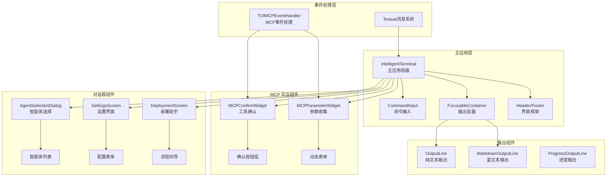
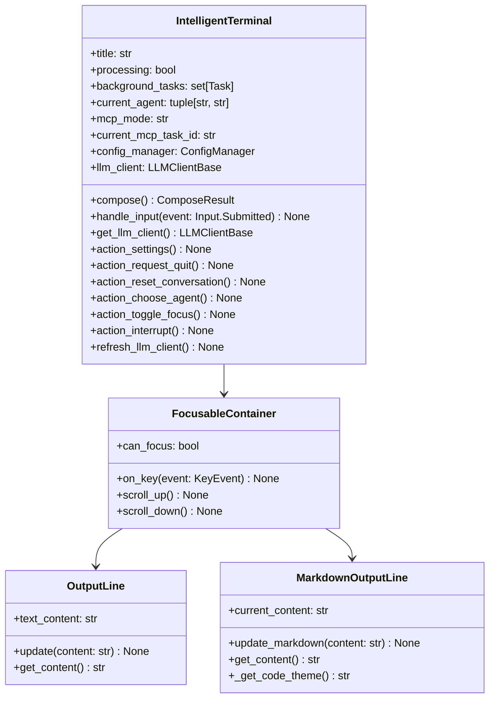
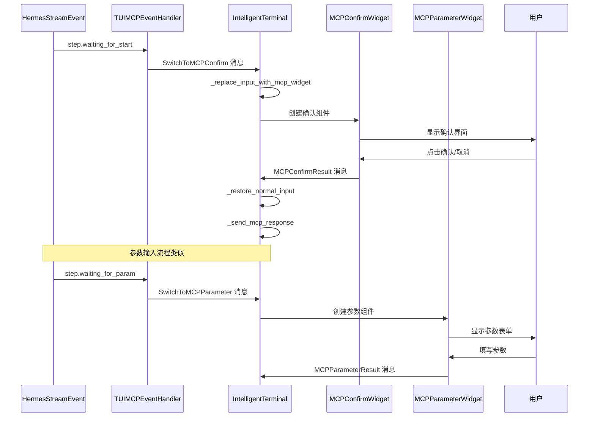
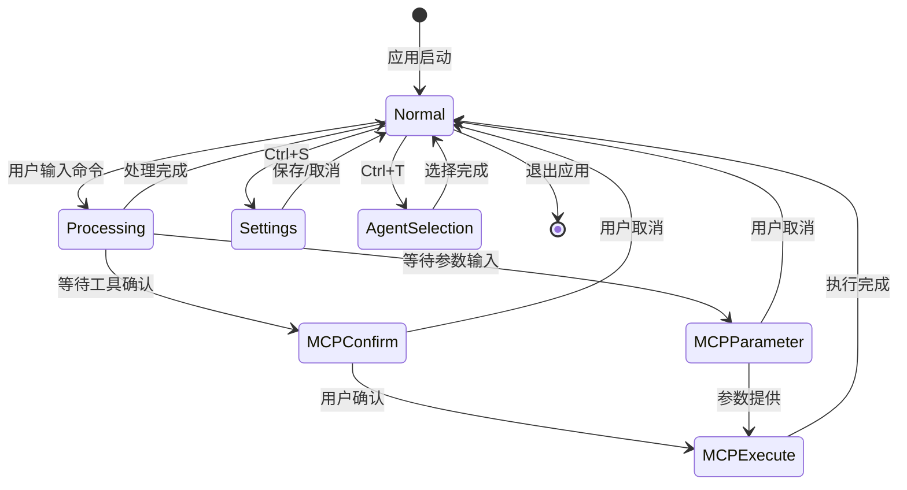
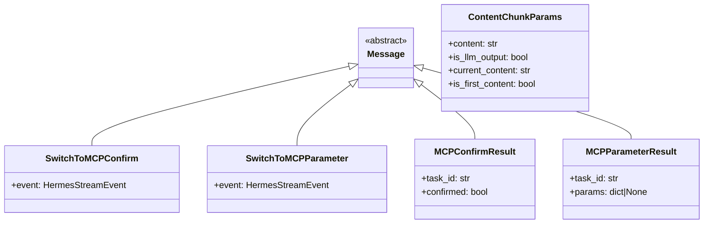
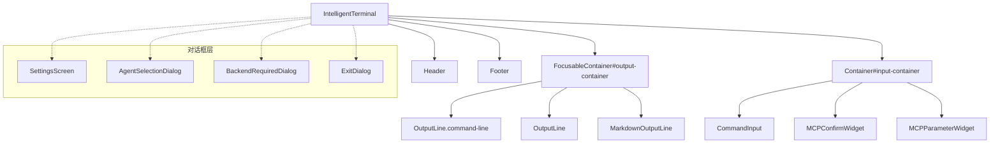
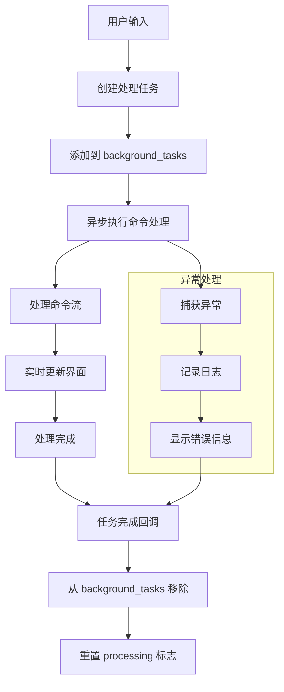

# TUI 应用模块设计

## 方案设计

### 整体方案设计

TUI 应用模块基于 Textual 框架构建，提供智能终端的用户界面。采用组件化设计，支持动态界面切换和事件驱动的交互模式。

#### 模块架构

#### 核心组件

1. **主界面组件** (`tui.py`)
   - 应用主窗口和布局管理
   - 异步任务管理和状态控制
   - 快捷键绑定和焦点控制（支持 Ctrl+C 中断当前会话）
   - MCP 模式切换机制与进度行跟踪

2. **MCP 交互组件** (`mcp_widgets.py`)
   - 工具确认界面和风险展示
   - 参数收集界面和表单验证
   - 用户交互结果回传

3. **对话框组件** (`dialogs/`)
   - 智能体选择和状态管理
   - 设置界面和配置持久化
   - 模态对话框基类

4. **部署助手** (`deployment/`)
   - 配置收集和验证界面
   - 部署进度实时显示
   - 状态监控和错误处理

### 详细设计

#### 主应用类设计

#### MCP 组件交互流程

#### 界面状态机

#### 消息系统设计

#### 组件布局结构

#### 异步任务管理

