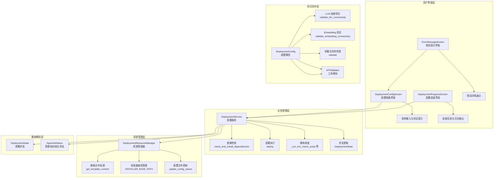
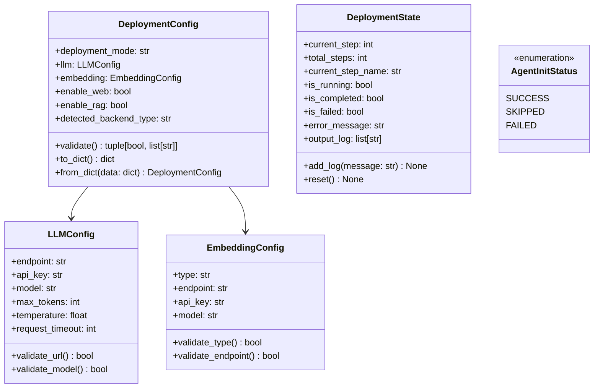
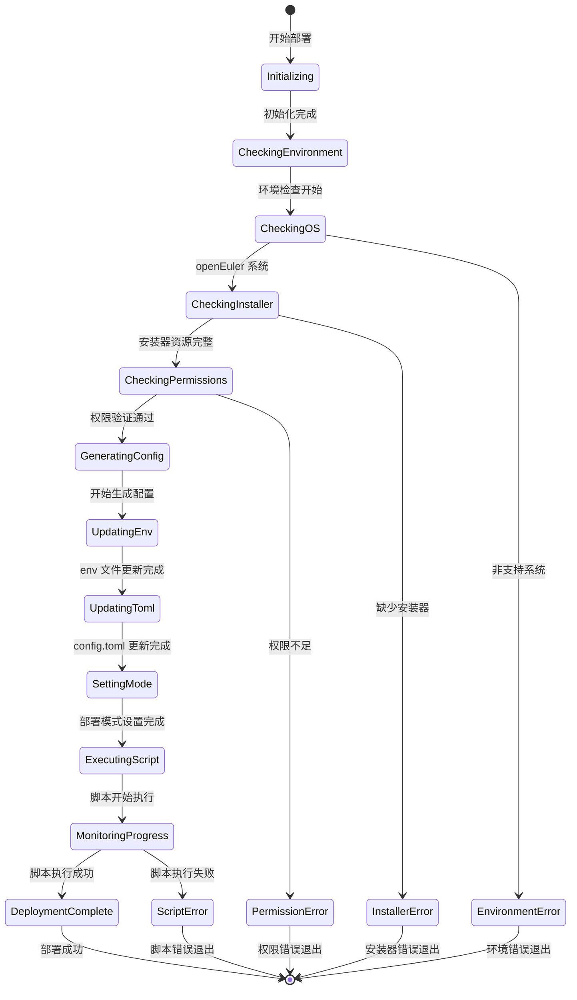
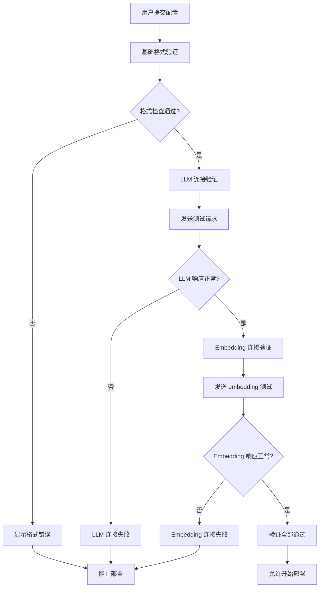
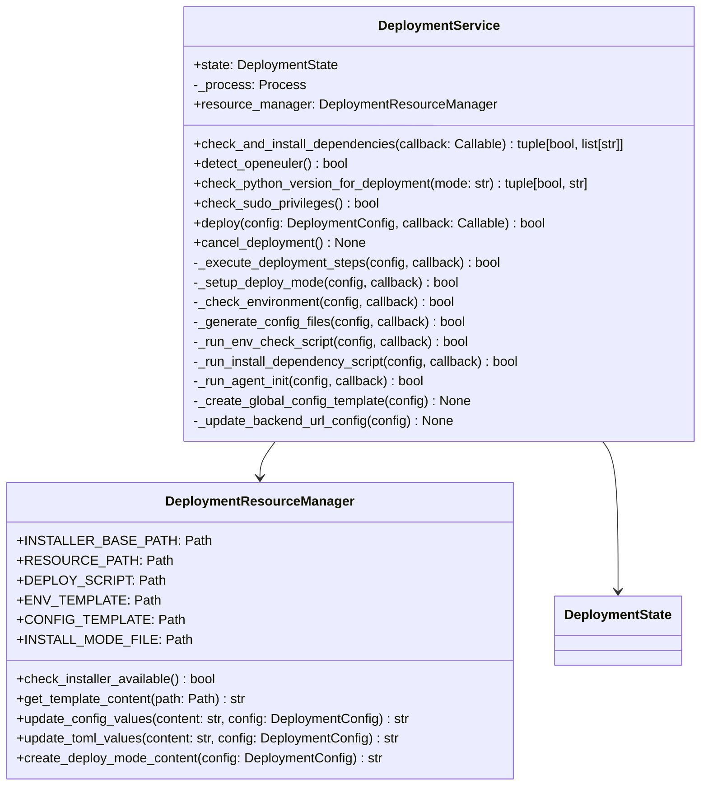
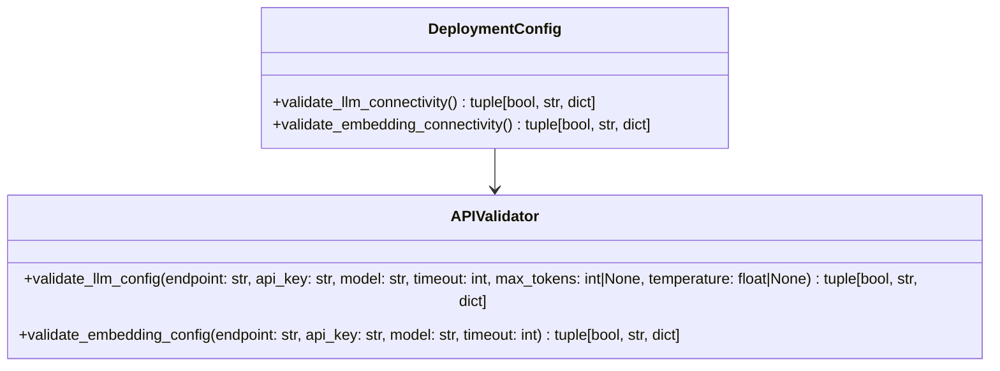
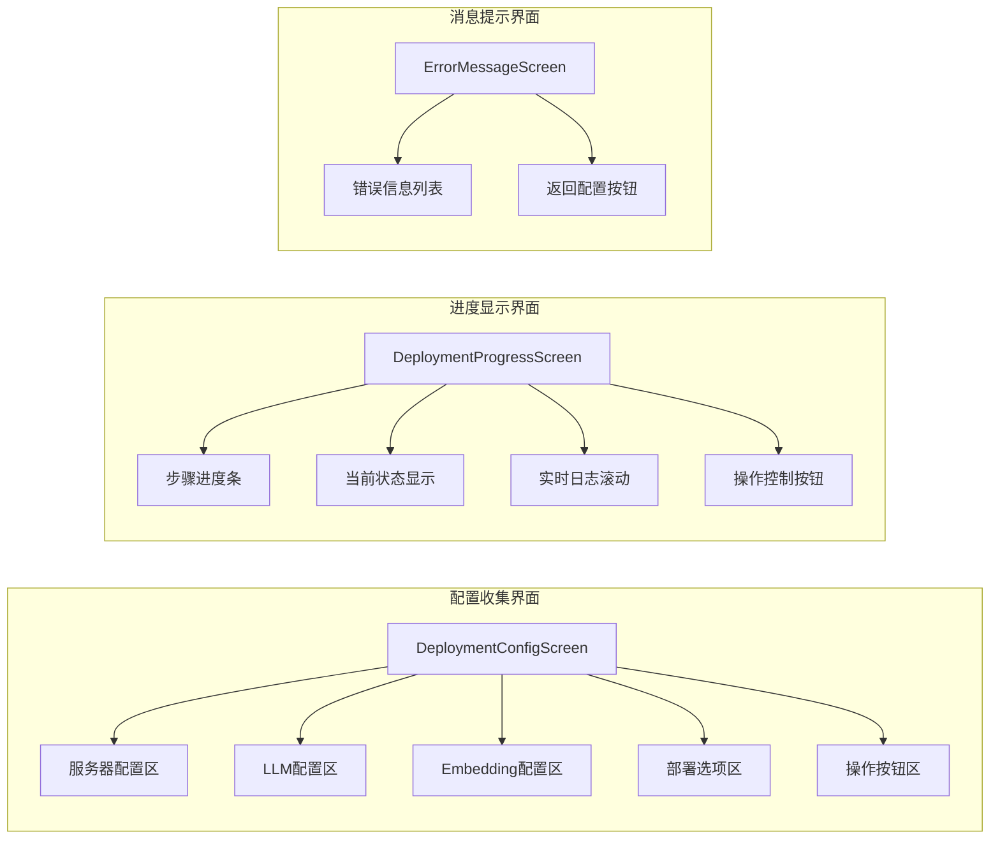
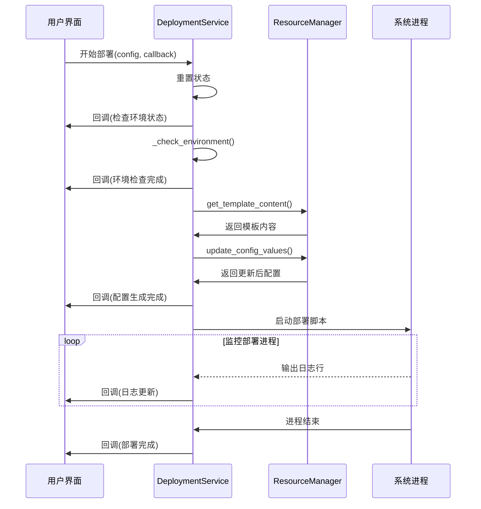
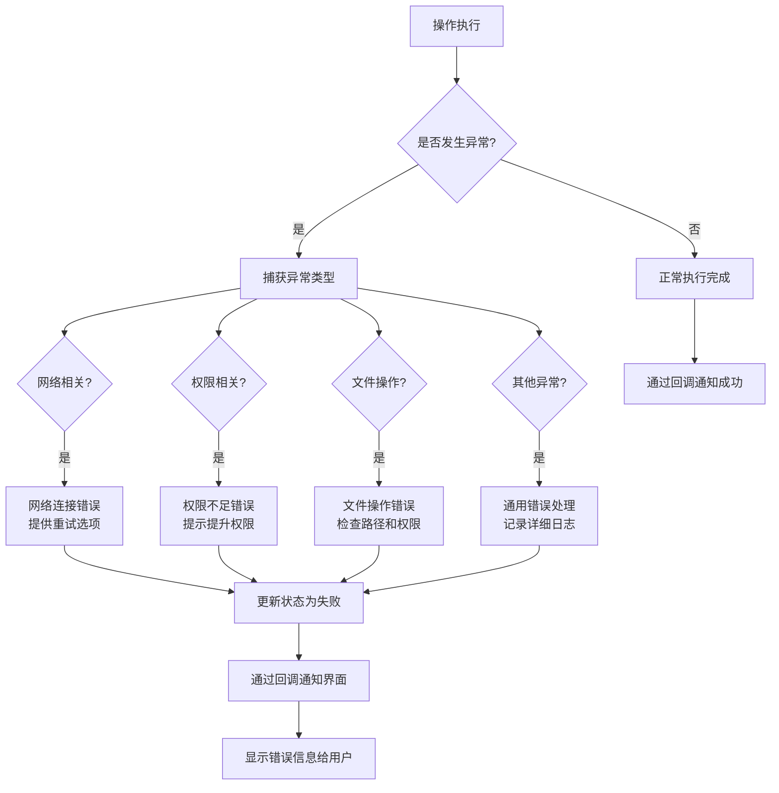

# 部署助手模块设计

## 方案设计

### 整体方案设计

部署助手模块提供可视化的 openEuler Intelligence 后端部署功能，支持环境检测、配置验证、自动部署和进度监控。

#### 模块架构

#### 核心组件

1. **界面组件** (`ui.py`)
   - 配置收集界面和表单验证
   - 部署进度实时显示
   - 验证结果和错误处理界面

2. **部署服务** (`service.py`)
   - 部署流程编排和状态管理
   - 依赖预检查与权限验证（`check_and_install_dependencies`）
   - 配置生成、脚本执行与 Agent 初始化

3. **API 验证器** (`tool/validators.py`)
   - LLM 与 Embedding API 连接测试
   - 多种 function_call/结构化输出能力探测
   - 为配置模型提供异步校验支持

4. **数据模型** (`models.py`)
   - 强类型的配置数据结构
   - 部署状态和进度追踪
   - 验证结果和错误信息

### 详细设计

#### 数据模型设计

#### 部署流程状态机

#### 配置验证流程

#### 部署服务架构

#### 验证器设计

#### 用户界面组件

#### 异步任务管理

#### 错误处理策略

