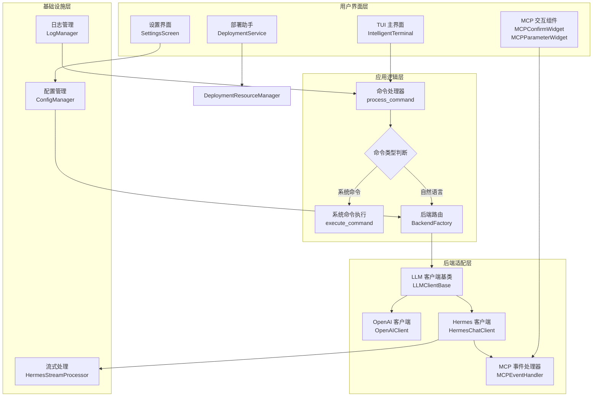
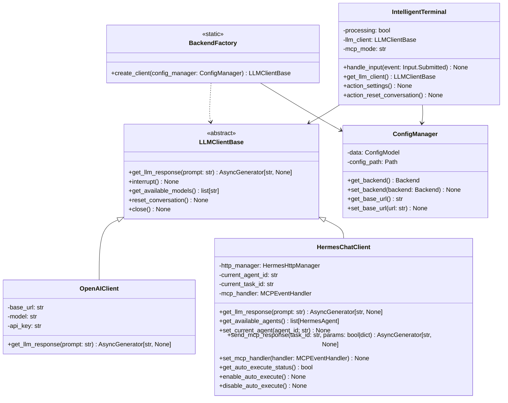
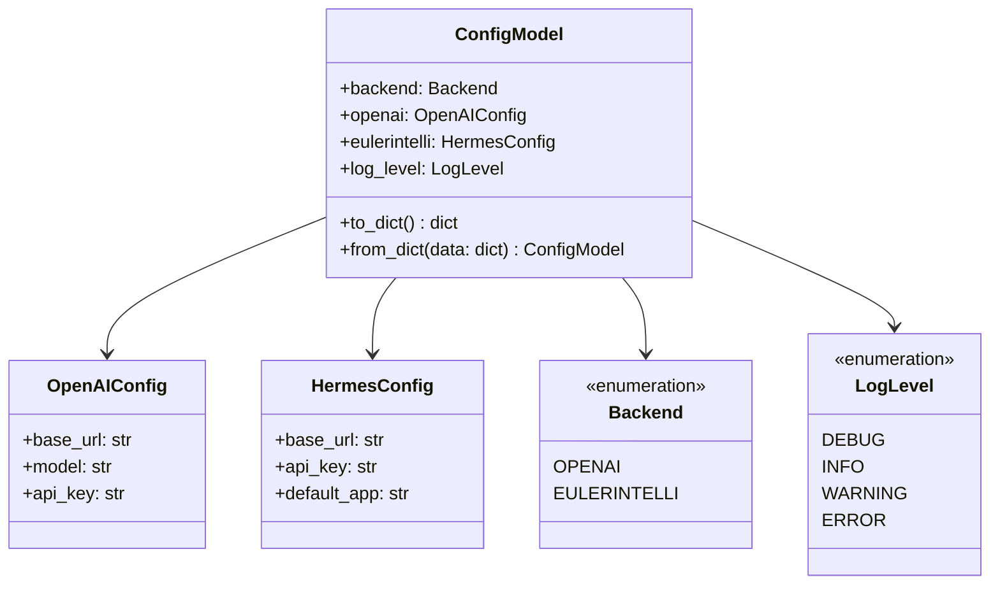
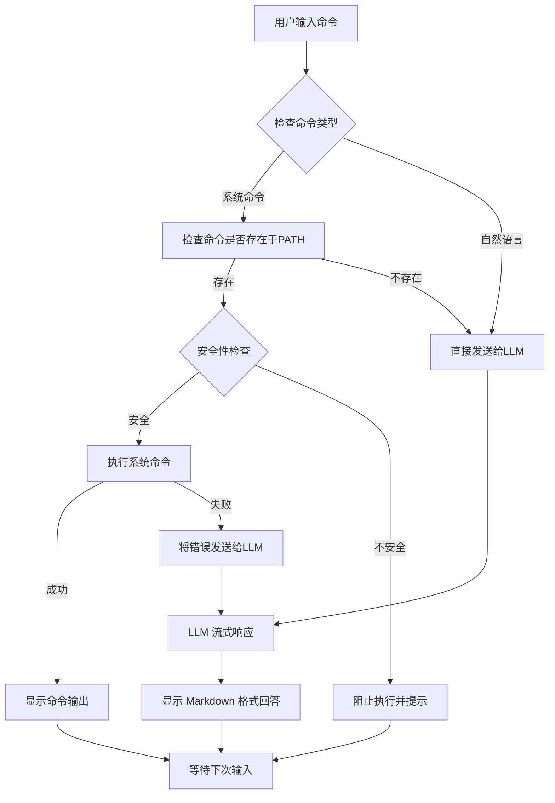
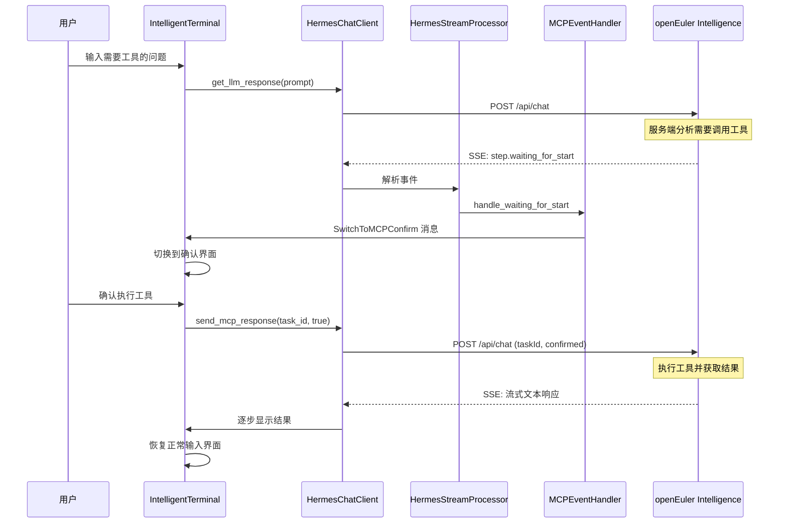
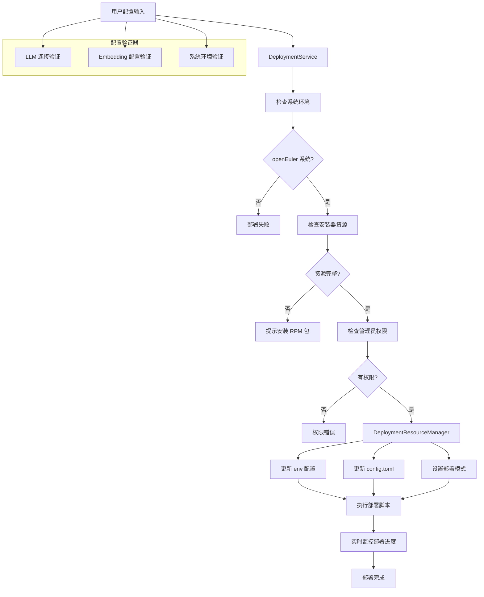
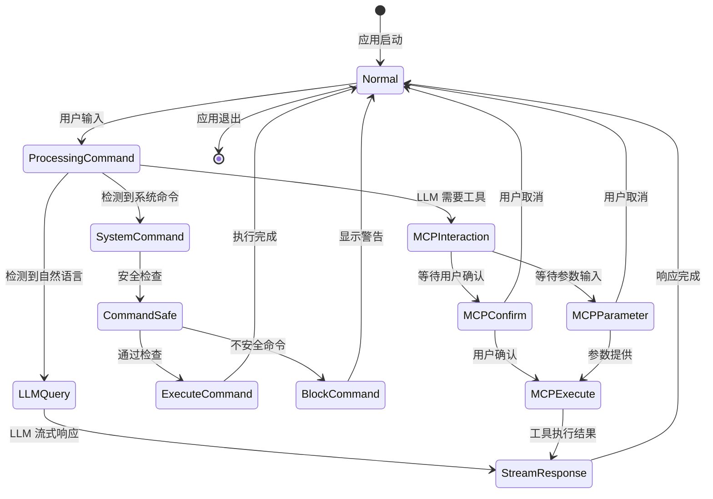
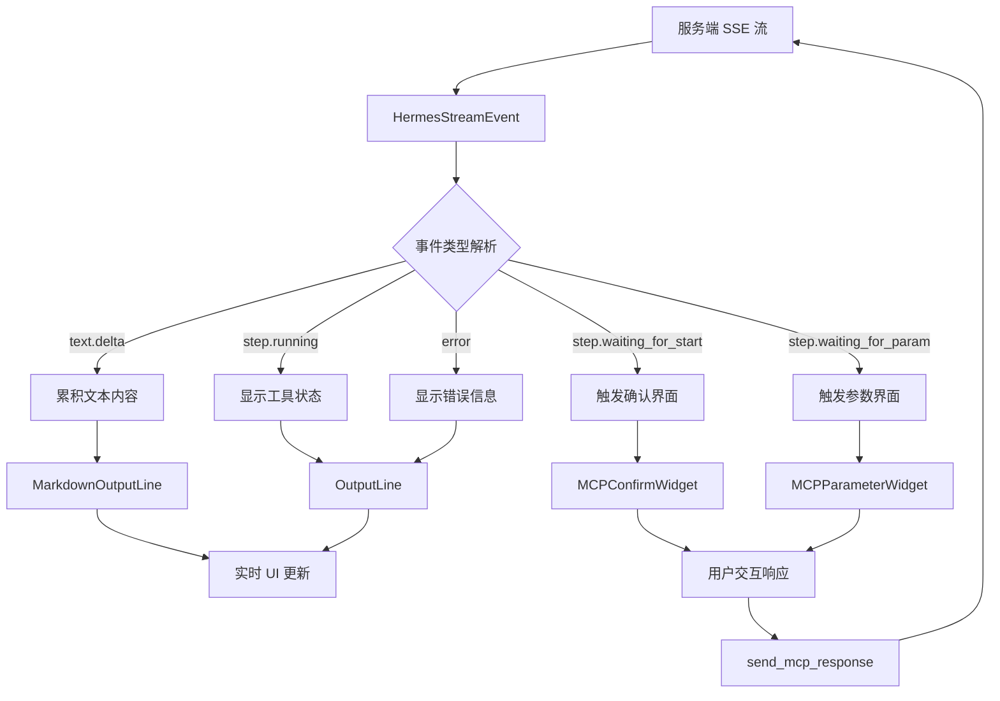
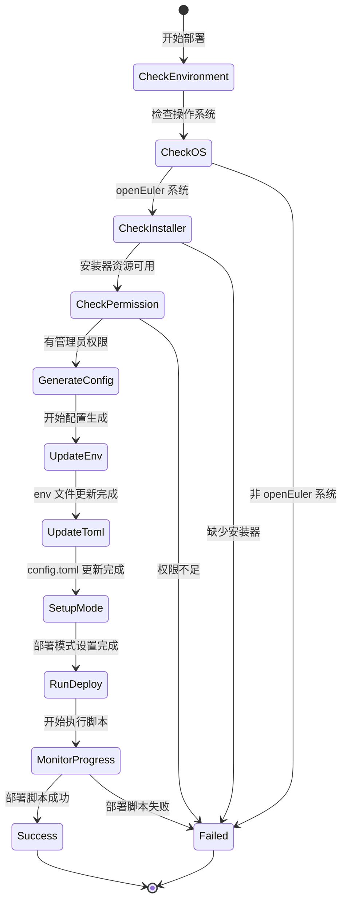
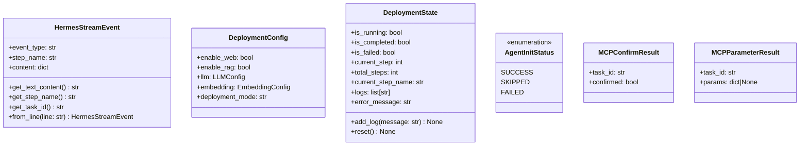

# openEuler Intelligence Smart Shell 项目整体设计

## 方案设计

### 整体方案设计

openEuler Intelligence Smart Shell 是一个基于 Python Textual 框架的智能终端应用，采用插件化架构支持多 LLM 后端，提供命令验证、自然语言处理和 MCP 工具集成功能。

#### 系统架构

#### 核心模块

1. **TUI 应用模块** (`app/`)
   - 基于 Textual 的主界面和交互组件
   - MCP 工具确认和参数输入界面
   - 部署助手界面和设置管理
   - 事件驱动的消息处理机制

2. **后端适配模块** (`backend/`)
   - 抽象基类 `LLMClientBase` 定义统一接口
   - `OpenAIClient` 支持 OpenAI 兼容 API
   - `HermesChatClient` 专用于 openEuler Intelligence
   - MCP 事件处理和流式响应解析

3. **工具处理模块** (`tool/`)
   - 命令安全性验证和系统命令执行
   - 智能化命令建议和错误处理

4. **基础设施模块**
   - 配置持久化存储和动态更新
   - 结构化日志记录和异常追踪

#### 设计原则

- **插件化架构**: 工厂模式实现后端无缝切换
- **事件驱动**: Textual 消息系统处理异步 UI 交互
- **流式优先**: 实时显示 LLM 响应内容
- **配置驱动**: 运行时动态配置和热重载

### 详细设计

#### 类图设计

#### 配置数据模型

配置文件位置: `~/.config/eulerintelli/smart-shell.json`

#### 命令处理流程

#### MCP 工具集成时序图

#### 部署助手架构设计

#### 核心交互流程

#### 流式数据处理

#### 部署流程状态机

#### 关键数据结构

