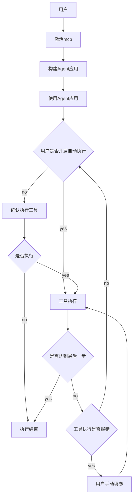
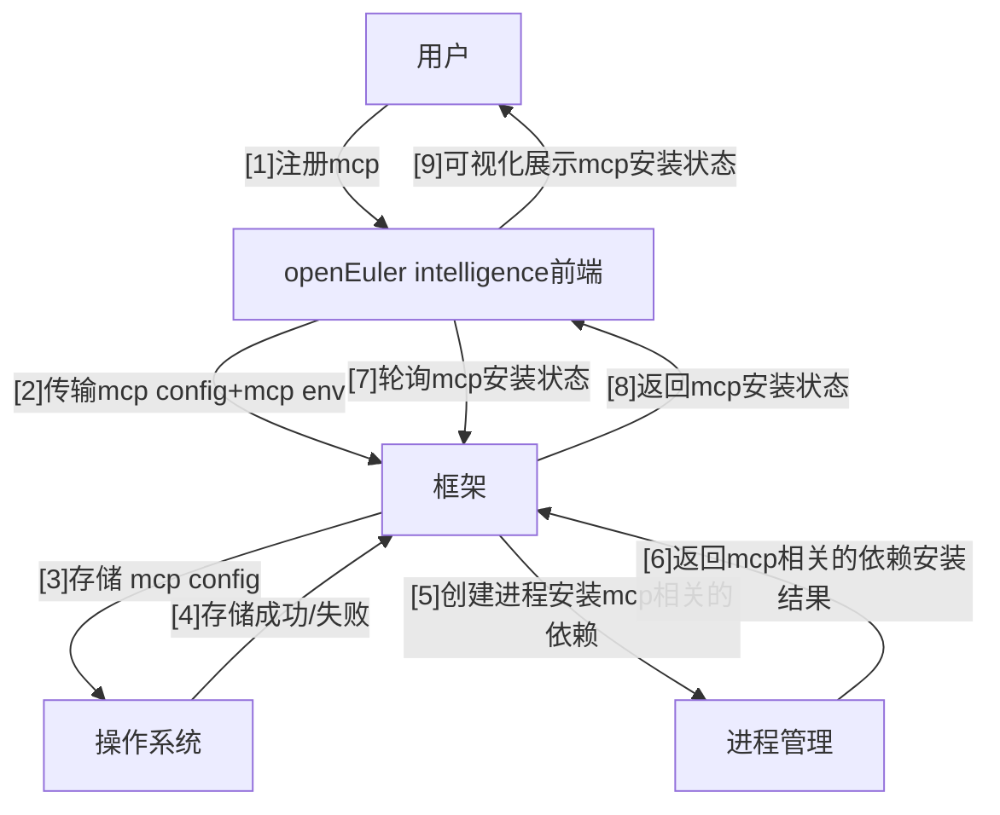
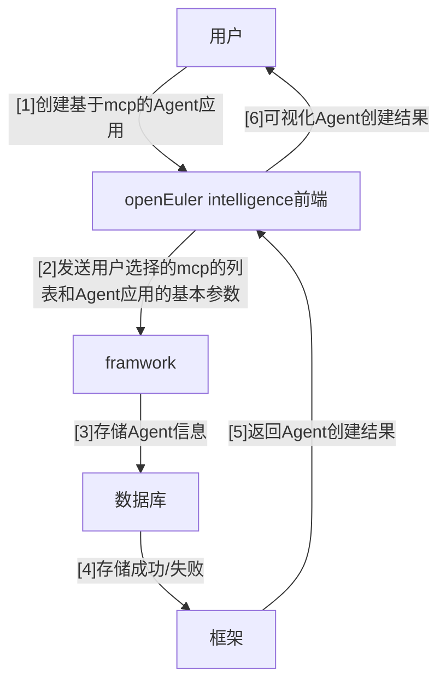
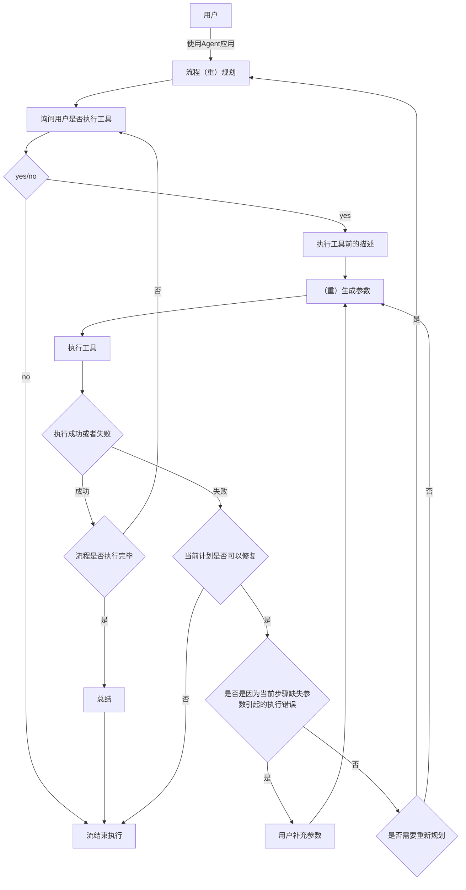

# openEuler Intelligence 框架交互

## 部署形态

在本地环境下 openEuler Intelligence 的部署形态如下图所示:


首先，当前有一套（基于rpm的）一键部署的脚本来用于 openEuler Intelligence 的部署，如上图所示，运行 openEuelr Intelligence 的最小单位是框架 + MongoDB，并且在部署之前可以在框架指定的目录下存放对应的 mcp config 并且在一键部署的脚本中填写 Agent 的配置，那么会在框架服务启动的时候将 mcp 服务进行注册和构建默认的 Agent。

其次，为了轻量化部署，降低本地运行消耗，在这套部署体系下 Web 和知识库是可选的（PS：Web 为了便携用户后续 MCP 注册和 Agent 的构建，知识库则是提供了文档治理和知识检索的能力，可以让框架在基本问答模式下更好的运作）。

接着，用户要使用 openEuler Intelligence 服务，需要和安装服务的人在同一个组；在本地环境下 openEuler Intelligence 不需要鉴权即可访问，通过识别当前操作系统用户名称作为当前用户的 user_sub，后续只要使用同一个用户进行登入那么即可访问用户使用的一些列历史记录。

最后，openEuler 提供了几个 API 用于对外提供 Agent 的能力，具体如下，在后文对其中的 chat 接口返回的信息中会更详细的讲解：

```text
GET /api/conversation （获取用户当前所有对话记录）

POST /api/conversation（创建新对话）

GET /api/record/{conversation_id}（获取会话下的所有用户和智能体的交互历史）

GET /api/chat（在会话中通过流式的形式与智能体会话）

GET /api/app（获取当前用户可用的智能体）
```

接口的输入&输出及详情可以通过加入下面团队进行访问

<https://app.apifox.com/invite/project?token=7-EmebiXuqcDcTNTC96p5>

## openEuler Intelligence 框架交互逻辑

### 用户整体的使用逻辑如下图所示



### MCP 注册



### Agent 构建



### 交互

这里的交互是指用户与Agent的交互，下面两个主要的交互示意图，一个主要是描述用户行为一个主要描述后端行为

#### 用户交互示意图



在使用chat接口与后端交互的时候会接收到流式返回的信息，单条流式消息内容模板如下（后续将与Agent的交互流程称为流）：

```json
{
  "event": "heartbeat",
  "id": "550e8400-e29b-41d4-a716-446655440000",
  "groupId": "550e8400-e29b-41d4-a716-446655440001",
  "conversationId": "550e8400-e29b-41d4-a716-446655440002",
  "taskId": "550e8400-e29b-41d4-a716-446655440003",
  "flow": {
   "appId": "3514eec9-699c-4ebd-85cc-e92caa24e141",
   "flowId": "0b7b5949-01f4-4e41-871e-d78fe01ec455",
   "stepId": "23641ffd-a8db-403a-9cf8-5ca305db3a0d",
   "stepName": "大模型",
   "stepStatus": "running"
  }
  "content": {
    "text": "这是一条心跳消息内容",
    "type": "heartbeat_info"
  },
  "metadata": {
    "inputTokens": 0,
    "outputTokens": 0,
    "timeCost": 0.05,
    "feature": null,
    "footNoteMetadataList": []
  }
}
```

event 代表这条流式消息的类型

groupId 代表这条流式消息关联的消息组 id

id 代表这条流式消息关联的消息记录的 id

conversationId 代表这条流式消息关联的对话的 id

taskId 代表这条流式消息关联的任务的 id

flow 代表这条流式消息关联的执行流的信息（内部含有当前执行的流来自的应用以及流的状态和基本等信息）

context 存放了前端真实要渲染的内容步骤的出参、入参和回显的文字等

节下面的事件类型和上面的模板下面有几种衍生信息

## 一、流状态转换关系

**初始化（init）→ 运行（running）**
触发条件：流初始化完成后开始工作
对应消息：init 消息后触发 flow.start 消息
**运行（running）→ 暂停（stop）**
触发条件：步骤需要用户确认执行（step.waiting_for_start）或等待补充参数（step.waiting_for_param）
对应消息：flow.stop 消息随步骤等待消息一同发送
**暂停（stop）→ 运行（running）**
触发条件：用户确认执行步骤或补充参数后，流恢复执行
对应消息：无单独流启动消息，通过步骤状态变更（step.input）体现流恢复运行
**运行（running）→ 失败（error）**
触发条件：单个步骤多次执行失败或其他异常
对应消息：flow.failed 消息，包含失败步骤信息
**运行 / 暂停（running/stop）→ 取消（cancel）**
触发条件：用户主动暂停对话或取消步骤执行
对应消息：flow.cancel 消息，同步更新流和步骤状态
**运行（running）→ 成功（success）**
触发条件：所有步骤执行完成且无异常
对应消息：flow.success 消息，标识流执行结束
**成功 / 失败（success/error）→ 通道关闭**
触发条件：流执行完成（无论成功或失败）
对应消息：成功时输出 [DONE]，失败时输出 [ERROR]

## 二、步骤状态转换关系

**初始化（init）→ 等待确认（waiting_for_start）**
触发条件：步骤初始化后，需用户确认是否执行（非自动执行模式）
对应消息：step.waiting_for_start 消息，包含风险提示
**初始化（init）→ 运行中（running）**
触发条件：步骤初始化后，无需用户确认（自动执行模式）
对应消息：无单独步骤运行消息，通过 step.input 消息体现
**等待确认（waiting_for_start）→ 运行中（running）**
触发条件：用户确认执行步骤
对应消息：step.input 消息，输出步骤入参
**等待确认（waiting_for_start）→ 取消（cancel）**
触发条件：用户拒绝执行步骤
对应消息：step.cancel 消息，同步终止流和步骤
**运行中（running）→ 成功（success）**
触发条件：步骤执行完成且无错误
对应消息：step.output 消息，输出步骤出参
**运行中（running）→ 等待参数（waiting_for_param）**
触发条件：步骤执行时发现参数缺失，需用户确认（非自动执行模式）
对应消息：step.waiting_for_param 消息，提示需补充的参数
**等待参数（waiting_for_param）→ 运行中（running）**
触发条件：用户补充参数后，步骤重新执行
对应消息：step.input 消息，使用补充后的参数执行
**运行中 / 等待确认 / 等待参数（running/waiting_for_start/waiting_for_param）→ 失败（error）**
触发条件：步骤执行报错且重试后仍失败
对应消息：无单独步骤失败消息，通过 flow.failed 消息体现
三、辅助状态转换关系
心跳状态（heartbeat）：无转换关系，在流运行期间定期发送，不影响其他状态
文本 / 文档输出状态（text.add/document.add）：仅在流和步骤处于 running 状态时触发，不改变主状态
步骤成功（success）→ 下步骤初始化（init）：当前步骤成功后，自动触发下一步骤初始化，对应 step.init 消息

```python
class EventType(str, Enum):
    """事件类型"""

    HEARTBEAT = "heartbeat"
    INIT = "init",
    TEXT_ADD = "text.add"
    GRAPH = "graph"
    DOCUMENT_ADD = "document.add"
    STEP_WAITING_FOR_START = "step.waiting_for_start"
    STEP_WAITING_FOR_PARAM = "step.waiting_for_param"
    FLOW_START = "flow.start"
    STEP_INIT = "step.init"
    STEP_INPUT = "step.input"
    STEP_OUTPUT = "step.output"
    STEP_CANCEL = "step.cancel"
    STEP_ERROR = "step.error"
    FLOW_STOP = "flow.stop"
    FLOW_FAILED = "flow.failed"
    FLOW_SUCCESS = "flow.success"
    FLOW_CANCEL = "flow.cancel"
    DONE = "done"
```

**流初始化信息**：代表当前流初始化完成要开始工作了

```json
data: {
 "event": "init",
 "id": "99473b7c-e158-49c6-b075-8232ad68d7a2",
 "groupId": "154054b1-5237-4cb4-adbe-148d1f395ec5",
 "conversationId": "b5c690b9-4232-4fb8-b0da-15ead469589c",
 "taskId": "31e66cf6-9d60-445c-9bad-191c0f16c29f",
 "content": {
  "feature": {
   "maxTokens": 8192,
   "contextNum": 3,
   "enableFeedback": false,
   "enableRegenerate": false
  },
  "createdAt": 1753621532.719
 },
 "metadata": {
  "inputTokens": 0,
  "outputTokens": 0,
  "timeCost": 0.011,
  "footNoteMetadataList": []
 }
}
```

**流开始信息**：代表流（重新）开始工作

```json
data: {
 "event": "flow.start",
 "id": "99473b7c-e158-49c6-b075-8232ad68d7a2",
 "groupId": "154054b1-5237-4cb4-adbe-148d1f395ec5",
 "conversationId": "b5c690b9-4232-4fb8-b0da-15ead469589c",
 "taskId": "31e66cf6-9d60-445c-9bad-191c0f16c29f",
 "flow": {
  "appId": "3514eec9-699c-4ebd-85cc-e92caa24e141", 
  "flowId": "0b7b5949-01f4-4e41-871e-d78fe01ec455", 
  "flowName": "test",
  "flowStatus": "running",
  "stepId": "", 
  "stepName": "", 
  "stepStatus": "unkown"
 },
 "content": {},
 "metadata": {
  "inputTokens": 0,
  "outputTokens": 0,
  "timeCost": 0.942,
  "footNoteMetadataList": []
 }
}
```

**流运行失败的消息**：单个步骤多次执行失败或其他异常清空流进入失败状态

```json
data: {
 "event": "flow.failed",
 "id": "d6f49ddf-0599-4950-89bf-cffec4bddc72",
 "groupId": "68bcb0aa-a1db-4be0-bef7-a70a8ba2360e",
 "conversationId": "5cdc5c08-5118-468d-80b4-27f906961266",
 "taskId": "0c0ff56f-8352-4835-a278-cf39ea943b15",
 "flow": {
  "appId": "3514eec9-699c-4ebd-85cc-e92caa24e141",
  "flowId": "0b7b5949-01f4-4e41-871e-d78fe01ec455",
  "flowName": "test",
  "flowStatus": "error",
  "stepId": "722f636a-4a66-4feb-80dd-7b2ea50ab494",
  "stepName": "shell工具执行",
  "stepStatus": "error",
 },
 "content": {},
 "metadata": {
  "inputTokens": 1004,
  "outputTokens": 62,
  "timeCost": 7.069,
  "footNoteMetadataList": []
 }
}
```

**流成功暂停运行的消息**：在步骤等待确认执行和待用户手填参数的时候会推出这个消息

```json
data: {
 "event": "flow.stop",
 "id": "d6f49ddf-0599-4950-89bf-cffec4bddc72",
 "groupId": "68bcb0aa-a1db-4be0-bef7-a70a8ba2360e",
 "conversationId": "5cdc5c08-5118-468d-80b4-27f906961266",
 "taskId": "0c0ff56f-8352-4835-a278-cf39ea943b15",
 "flow": {
  "appId": "3514eec9-699c-4ebd-85cc-e92caa24e141",
  "flowId": "0b7b5949-01f4-4e41-871e-d78fe01ec455",
  "flowName": "test",
  "flowStatus": "stop",
  "stepId": "722f636a-4a66-4feb-80dd-7b2ea50ab494",
  "stepName": "shell工具执行",
  "stepStatus": "waiting"
 },
 "content": {},
 "metadata": {
  "inputTokens": 1004,
  "outputTokens": 62,
  "timeCost": 7.069,
  "footNoteMetadataList": []
 }
}
```

**流取消运行的消息**：用户暂停对话或者取消某个步骤的执行

```json
data: {
 "event": "flow.cancel",
 "id": "d6f49ddf-0599-4950-89bf-cffec4bddc72",
 "groupId": "68bcb0aa-a1db-4be0-bef7-a70a8ba2360e",
 "conversationId": "5cdc5c08-5118-468d-80b4-27f906961266",
 "taskId": "0c0ff56f-8352-4835-a278-cf39ea943b15",
 "flow": {
  "appId": "3514eec9-699c-4ebd-85cc-e92caa24e141",
  "flowId": "0b7b5949-01f4-4e41-871e-d78fe01ec455",
  "flowName": "test",
  "flowStatus": "cancel",
  "stepId": "722f636a-4a66-4feb-80dd-7b2ea50ab494",
  "stepName": "记忆存储",
  "stepStatus": "cancel"
 },
 "content": {},
 "metadata": {
  "inputTokens": 1004,
  "outputTokens": 62,
  "timeCost": 7.069,
  "footNoteMetadataList": []
 }
}
```

**流成功运行的消息**：流执行成功的消息

```json
data: {
 "event": "flow.success",
 "id": "d6f49ddf-0599-4950-89bf-cffec4bddc72",
 "groupId": "68bcb0aa-a1db-4be0-bef7-a70a8ba2360e",
 "conversationId": "5cdc5c08-5118-468d-80b4-27f906961266",
 "taskId": "0c0ff56f-8352-4835-a278-cf39ea943b15",
 "flow": {
  "appId": "3514eec9-699c-4ebd-85cc-e92caa24e141",
  "flowId": "0b7b5949-01f4-4e41-871e-d78fe01ec455",
  "flowName": "test",
  "flowStatus": "success",
  "stepId": "722f636a-4a66-4feb-80dd-7b2ea50ab494",
  "stepName": "记忆存储",
  "stepStatus": "success"
 },
 "content": {},
 "metadata": {
  "inputTokens": 1004,
  "outputTokens": 62,
  "timeCost": 7.069,
  "footNoteMetadataList": []
 }
}
```

**MCP tool 初始化消息:**

```json
data: {
 "event": "step.init",
 "id": "d6f49ddf-0599-4950-89bf-cffec4bddc72",
 "groupId": "68bcb0aa-a1db-4be0-bef7-a70a8ba2360e",
 "conversationId": "5cdc5c08-5118-468d-80b4-27f906961266",
 "taskId": "0c0ff56f-8352-4835-a278-cf39ea943b15",
 "flow": {
  "appId": "3514eec9-699c-4ebd-85cc-e92caa24e141",
  "flowId": "0b7b5949-01f4-4e41-871e-d78fe01ec455",
  "flowName": "test",
  "flowStatus": "running",
  "stepId": "b61aae5a-ed17-40ba-9b2c-6a96a0f0878a",
  "stepName": "知识库",
  "stepStatus": "init"
 },
 "content": {
 },
 "metadata": {
  "inputTokens": 195,
  "outputTokens": 15,
  "timeCost": 0.002,
  "footNoteMetadataList": []
 }
}
```

**MCP tool等待用户确认执行的信息**：

```json
data: {
 "event": "step.waiting_for_start",
 "id": "d6f49ddf-0599-4950-89bf-cffec4bddc72",
 "groupId": "68bcb0aa-a1db-4be0-bef7-a70a8ba2360e",
 "conversationId": "5cdc5c08-5118-468d-80b4-27f906961266",
 "taskId": "0c0ff56f-8352-4835-a278-cf39ea943b15",
 "flow": {
  "appId": "3514eec9-699c-4ebd-85cc-e92caa24e141",
  "flowId": "0b7b5949-01f4-4e41-871e-d78fe01ec455",
  "flowName": "test",
  "flowStatus": "stop",
  "stepId": "b61aae5a-ed17-40ba-9b2c-6a96a0f0878a",
  "stepName": "知识库",
  "stepStatus": "waiting"
 },
 "content": {
  "risk": "low",
​  "reason": "知识库查询可能会造成时延！"
​ },
​ "metadata": {
​  "inputTokens": 195,
​  "outputTokens": 15,
​  "timeCost": 0.002,
​  "footNoteMetadataList": []
​ }
}
```

**MCP tool等待用户补充参数：**

```json
data: {
 "event": "step.waiting_for_param",
 "id": "d6f49ddf-0599-4950-89bf-cffec4bddc72",
 "groupId": "68bcb0aa-a1db-4be0-bef7-a70a8ba2360e",
 "conversationId": "5cdc5c08-5118-468d-80b4-27f906961266",
 "taskId": "0c0ff56f-8352-4835-a278-cf39ea943b15",
 "flow": {
  "appId": "3514eec9-699c-4ebd-85cc-e92caa24e141",
  "flowId": "0b7b5949-01f4-4e41-871e-d78fe01ec455",
  "flowName": "test",
  "flowStatus": "stop",
  "stepId": "b61aae5a-ed17-40ba-9b2c-6a96a0f0878a",
  "stepName": "高德地图",
  "stepStatus": "param"
 },
 "content": {
  "message": "当运行产生如下报错：\n缺少access key" ,
  "params": params_with_null
 },
 "metadata": {
  "inputTokens": 195,
  "outputTokens": 15,
  "timeCost": 0.002,
  "footNoteMetadataList": []
 }
}
```

**MCP tool 取消执行：**

```json
data: {
 "event": "step.cancal",
 "id": "d6f49ddf-0599-4950-89bf-cffec4bddc72",
 "groupId": "68bcb0aa-a1db-4be0-bef7-a70a8ba2360e",
 "conversationId": "5cdc5c08-5118-468d-80b4-27f906961266",
 "taskId": "0c0ff56f-8352-4835-a278-cf39ea943b15",
 "flow": {
  "appId": "3514eec9-699c-4ebd-85cc-e92caa24e141",
  "flowName": "test",
  "flowStatus": "cancel",
  "flowId": "0b7b5949-01f4-4e41-871e-d78fe01ec455",
  "stepId": "b61aae5a-ed17-40ba-9b2c-6a96a0f0878a",
  "stepName": "高德地图",
  "stepStatus": "cancel"
 },
 "content": {
 },
 "metadata": {
  "inputTokens": 195,
  "outputTokens": 15,
  "timeCost": 0.002,
  "footNoteMetadataList": []
 }
}
```

**MCP tool执行的入参信息**：content中是入参的真实内容

```json
data: {
 "event": "step.input",
 "id": "d6f49ddf-0599-4950-89bf-cffec4bddc72",
 "groupId": "68bcb0aa-a1db-4be0-bef7-a70a8ba2360e",
 "conversationId": "5cdc5c08-5118-468d-80b4-27f906961266",
 "taskId": "0c0ff56f-8352-4835-a278-cf39ea943b15",
 "flow": {
  "appId": "3514eec9-699c-4ebd-85cc-e92caa24e141",
  "flowId": "0b7b5949-01f4-4e41-871e-d78fe01ec455",
  "flowName": "test",
  "flowStatus": "running",
  "stepId": "b61aae5a-ed17-40ba-9b2c-6a96a0f0878a",
  "stepName": "end",
  "stepStatus": "running"
 },
 "content": {
  "session_id": "fcdbca3513c8e61de58eeeef88c8ada6",
  "kbIds": [],
  "topK": 5,
  "query": "231",
  "searchMethod": "keyword_and_vector",
  "isRelatedSurrounding": true,
  "isClassifyByDoc": false,
  "isRerank": false,
  "isCompress": false,
  "tokensLimit": 8192
 },
 "metadata": {
  "inputTokens": 195,
  "outputTokens": 15,
  "timeCost": 0.002,
  "footNoteMetadataList": []
 }
}


```

**Mcp tool执行的出参信息**：content中是入参的真实内容

```json
data: {
 "event": "step.output",
 "id": "d6f49ddf-0599-4950-89bf-cffec4bddc72",
 "groupId": "68bcb0aa-a1db-4be0-bef7-a70a8ba2360e",
 "conversationId": "5cdc5c08-5118-468d-80b4-27f906961266",
 "taskId": "0c0ff56f-8352-4835-a278-cf39ea943b15",
 "flow": {
  "appId": "3514eec9-699c-4ebd-85cc-e92caa24e141",
  "flowId": "0b7b5949-01f4-4e41-871e-d78fe01ec455",
  "flowName": "test",
  "flowStatus": "running",
  "stepId": "b61aae5a-ed17-40ba-9b2c-6a96a0f0878a",
  "stepName": "知识库",
  "stepStatus": "success"
 },
 "content": {
  "question": "231",
  "corpus": []
 },
 "metadata": {
  "inputTokens": 590,
  "outputTokens": 26,
  "timeCost": 1.855,
  "footNoteMetadataList": []
 }
}
```

**Agent运行过程中输出文本消息**：交互过程中大模型的总结

```json
data: {
 "event": "text.add",
 "id": "d6f49ddf-0599-4950-89bf-cffec4bddc72",
 "groupId": "68bcb0aa-a1db-4be0-bef7-a70a8ba2360e",
 "conversationId": "5cdc5c08-5118-468d-80b4-27f906961266",
 "taskId": "0c0ff56f-8352-4835-a278-cf39ea943b15",
 "flow": {
  "appId": "3514eec9-699c-4ebd-85cc-e92caa24e141",
  "flowId": "0b7b5949-01f4-4e41-871e-d78fe01ec455",
  "flowName": "test",
  "flowStatus": "running",
  "stepId": "23641ffd-a8db-403a-9cf8-5ca305db3a0d",
  "stepName": "总结",
  "stepStatus": "running"
 },
 "content": {
  "text": "你好"
 },
 "metadata": {
  "inputTokens": 590,
  "outputTokens": 26,
  "timeCost": 1.351,
  "footNoteMetadataList": []
 }
}
```

**Agent运行过程中输出文档消息**：当前文档来自于rag，后续如果有来自于网上或者实时生成可以考虑在content加入documentSource字段来动态获取文档本体

```json
data: {
 "event": "document.add",
 "id": "d9582240-b7e4-4e7c-8443-02385f9ef178",
 "groupId": "a619941d-12f6-49d3-a8c0-95e089932539",
 "conversationId": "ba3c4e4f-1ae3-42cd-878f-d3261618cf29",
 "taskId": "db458861-9e1c-4de0-aab2-48c2c285cc96",
 "flow": {
  "appId": "3514eec9-699c-4ebd-85cc-e92caa24e141",
  "flowId": "0b7b5949-01f4-4e41-871e-d78fe01ec455",
  "flowName": "test",
  "flowStatus": "running",
  "stepId": "23641ffd-a8db-403a-9cf8-5ca305db3a0d",
  "stepName": "文档生成",
  "stepStatus": "running"
 },
 "content": {
  "documentId": "3760ae3e-b55a-4c30-8785-58f5e4a4e0dd",
  "documentOrder": 1,
  "documentAuthor": "42497",
  "documentName": "openEuler 24.03 LTS SP1 技术白皮书-1-13.pdf",
  "documentAbstract": "openEuler 技术白皮书\nopenEuler 24.03 LTS SP1 技术白皮书\n1.概述\nOpenAtom openEuler（简称“openEuler”） 社区是一个面向数字基础设施操作系统的开源社区。由开\n放原子开源基金会（以下简称“基金会",
  "documentType": "pdf",
  "documentSize": 778615.0,
  "createdAt": 1753623806.708
 },
 "metadata": {
  "inputTokens": 8306,
  "outputTokens": 0,
  "timeCost": 2.191,
  "footNoteMetadataList": []
 }
}
```

**流运行成功消息通道关闭的特殊消息**：意味着前端循环可以break了

```text
data: [DONE]
```

**流运行失败消息通道关闭的特殊消息**：意味着前端循环可以break了

```text
data: [ERROR]
```

**心跳消息**：保活

```json
data: {"event": "heartbeat"}
```

状态转换关系描述
