# 后端适配模块设计

## 方案设计

### 整体方案设计

后端适配模块提供统一的 LLM 客户端接口，支持多种后端实现。采用抽象基类和工厂模式，确保接口一致性和可扩展性。

#### 模块架构

#### 核心组件

1. **抽象基类** (`base.py`)
   - 定义统一的客户端接口规范
   - 提供异步上下文管理器支持
   - 确保接口一致性

2. **OpenAI 客户端** (`openai.py`)
   - 兼容 OpenAI API 的标准实现
   - 支持对话历史管理
   - 流式响应处理

3. **Hermes 客户端** (`hermes/`)
   - 专为 openEuler Intelligence 设计
   - 完整的 MCP 工具支持
   - 智能体管理和会话持久化
   - 模块化服务管理

4. **工厂类** (`factory.py`)
   - 根据配置动态创建客户端
   - 统一的客户端创建接口

### 详细设计

#### 抽象基类设计

#### Hermes 客户端服务架构

#### MCP 事件处理流程

#### 工厂模式实现

#### 流式数据处理设计

#### 异常处理策略

#### 服务管理器设计

```mermaid
classDiagram
    class HermesUserManager {
        -http_manager: HermesHttpManager
        +get_user_info() dict
        +update_auto_execute(auto_execute: bool) None
    }
    
    class HermesAgentManager {
        -http_manager: HermesHttpManager
        +get_available_agents() list[HermesAgent]
        -_fetch_agents_page(page: int) dict
    }
    
    class HermesConversationManager {
        -http_manager: HermesHttpManager
        -current_conversation_id: str
        +ensure_conversation() str
        +reset_conversation() None
        +stop_conversation() None
        -_create_conversation() str
    }
    
    class HermesModelManager {
        -http_manager: HermesHttpManager
        +get_available_models() list[str]
    }
    
    class HermesStreamProcessor {
        +handle_special_events(event: HermesStreamEvent) tuple[bool, str]
        +format_mcp_status(event: HermesStreamEvent) str
        +get_no_content_message(event_count: int) str
        +log_text_content(content: str) None
    }
```

