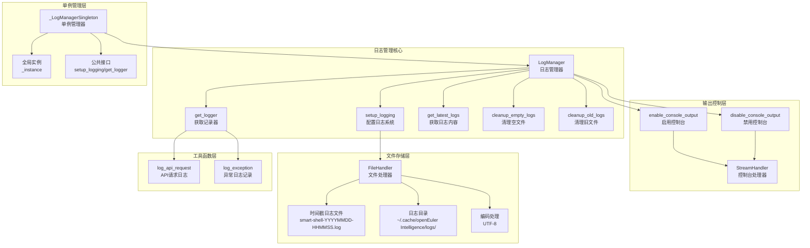
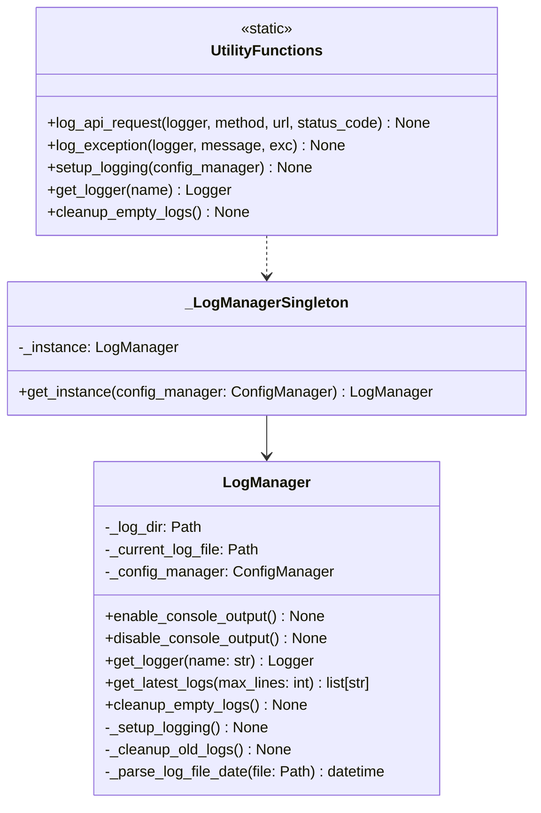
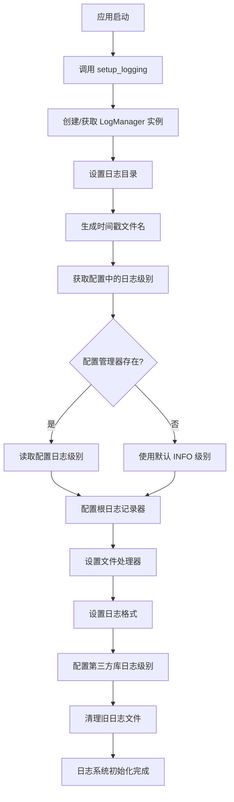
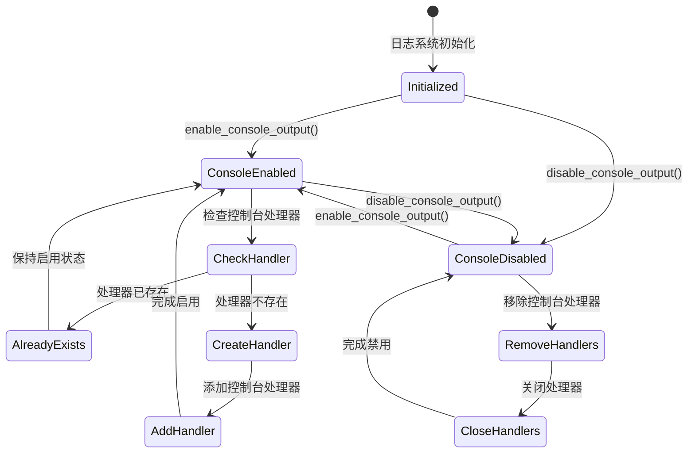
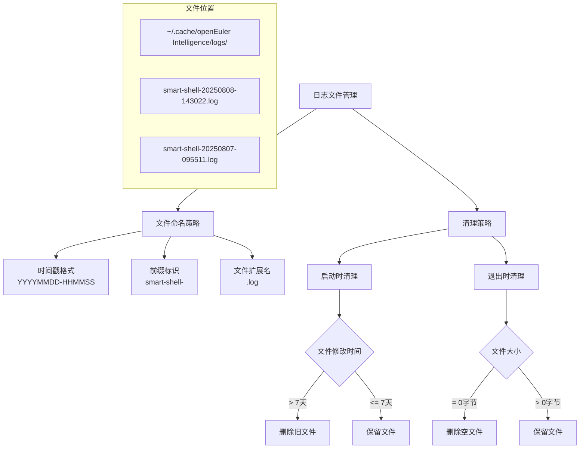
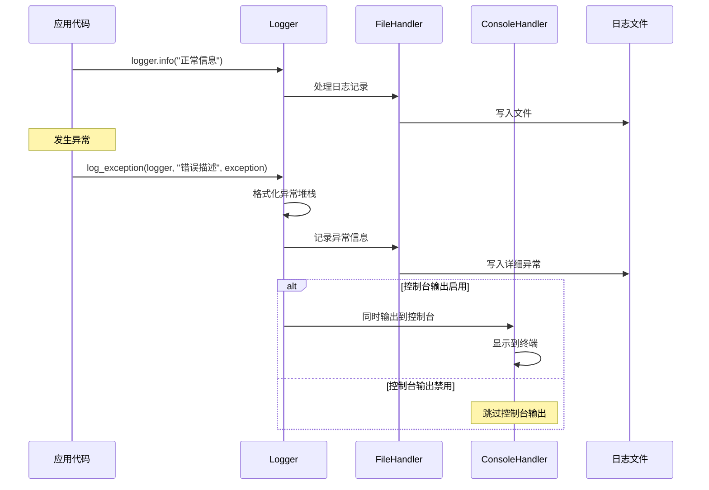
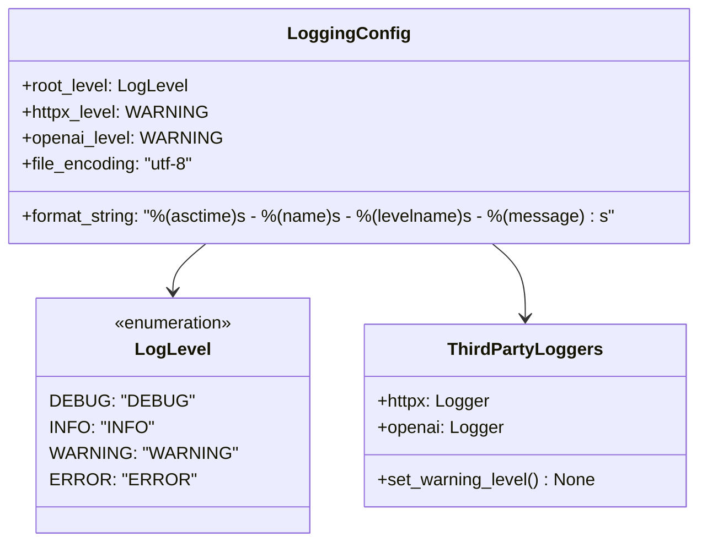
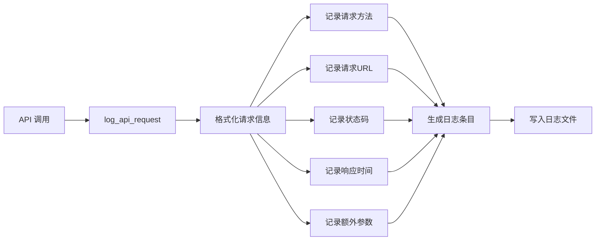
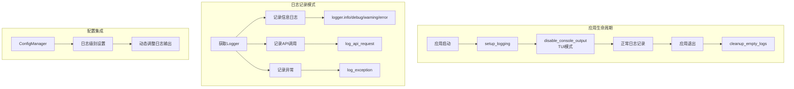

# 日志管理模块设计

## 方案设计

### 整体方案设计

日志管理模块提供统一的日志记录功能，支持多级别日志、自动清理、控制台输出控制和性能监控。

#### 模块架构

#### 核心功能

1. **多级别日志系统**: 支持 DEBUG、INFO、WARNING、ERROR 四个级别
2. **时间戳文件管理**: 每次启动创建新的时间戳日志文件，避免冲突
3. **TUI 模式兼容**: 动态控制控制台输出，避免干扰 TUI 界面
4. **自动清理机制**: 删除 7 天前的旧日志文件和空日志文件
5. **异常追踪**: 完整的异常堆栈记录和格式化输出
6. **单例模式**: 全局统一的日志管理实例和配置

### 详细设计

#### 日志管理器类设计

#### 日志配置流程

#### 控制台输出控制

#### 文件管理策略

#### 异常处理与日志记录

#### 日志级别配置

#### API 日志记录工具

#### 使用模式与最佳实践

