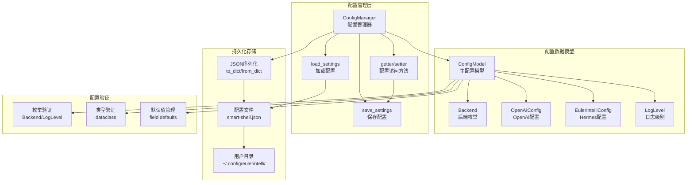
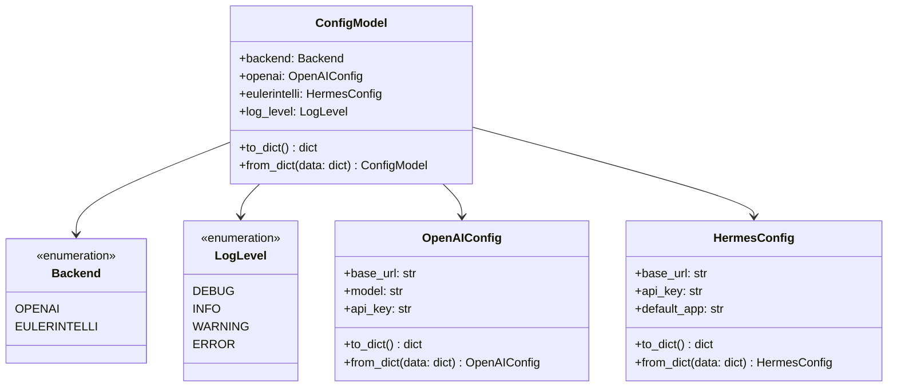
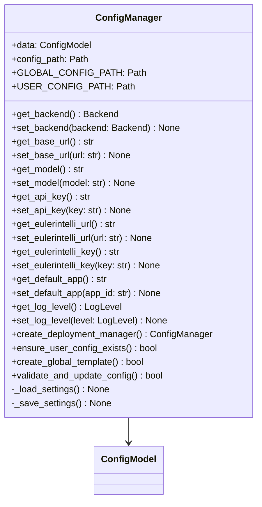
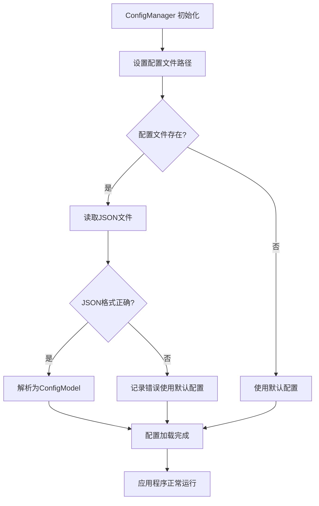
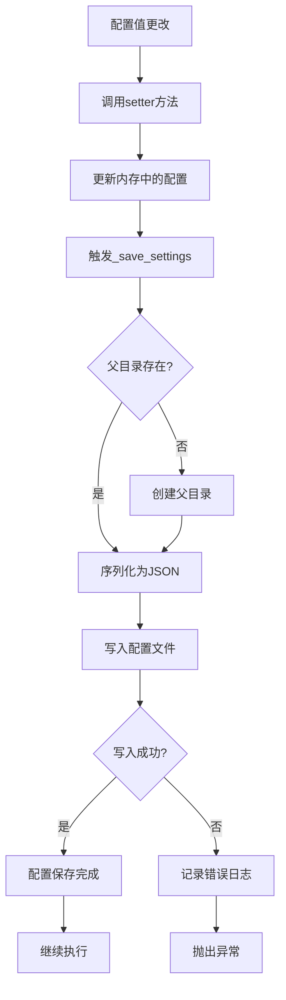
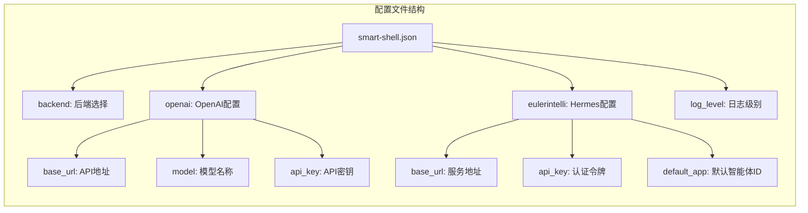
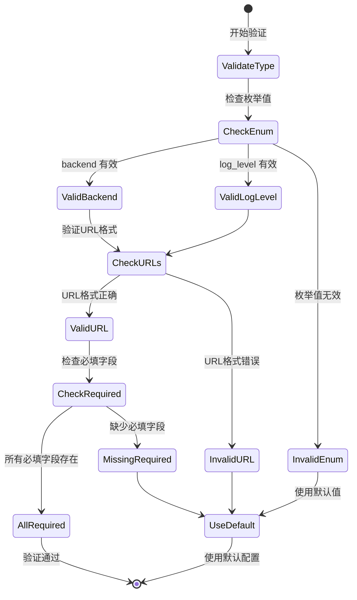
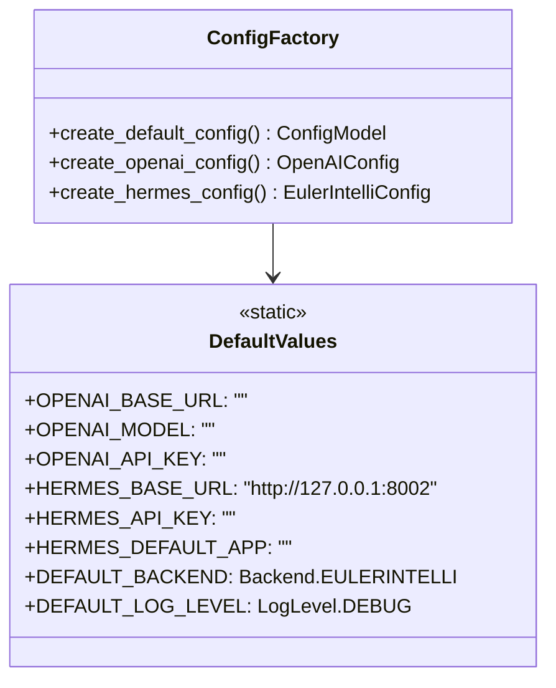
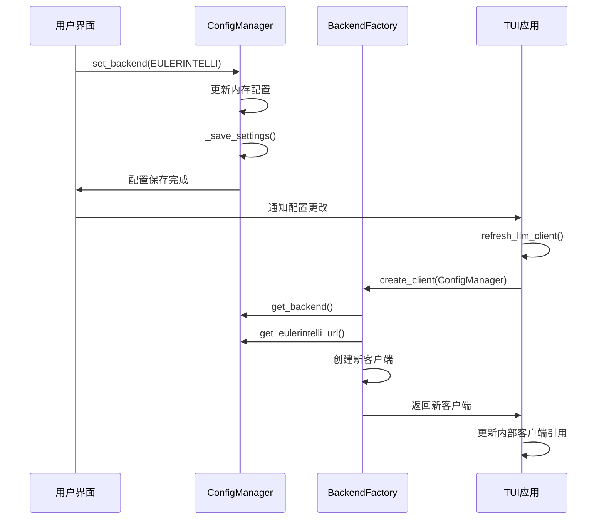

# 配置管理模块设计

## 方案设计

### 整体方案设计

配置管理模块提供应用程序的配置存储、读取和管理功能，支持多后端配置、运行时配置变更和配置验证。

#### 模块架构

#### 核心功能

1. **多后端配置管理**: 支持 OpenAI 和 openEuler Intelligence 后端配置
2. **持久化存储**: 自动保存配置到用户配置目录
3. **运行时热更新**: 支持运行时配置修改并立即生效
4. **类型安全**: 使用 dataclass 和枚举确保类型安全
5. **默认值体系**: 提供合理的开箱即用默认配置

### 详细设计

#### 配置数据模型设计

#### 配置管理器设计

#### 配置加载流程

#### 配置保存机制

#### 配置文件结构

配置文件位置: `~/.config/eulerintelli/smart-shell.json`

#### 配置验证策略

#### 默认值管理

#### 配置更新通知机制

